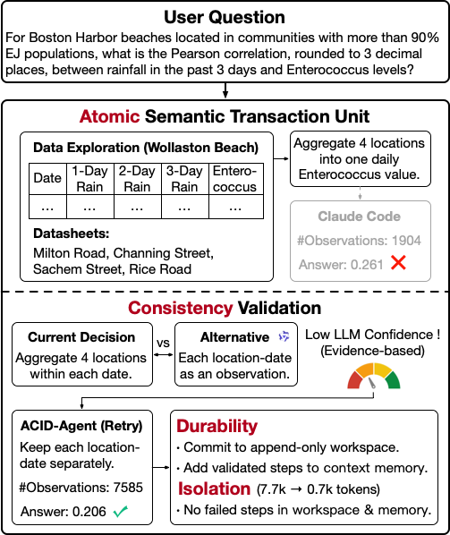

# Agentic Transaction: Towards ACID-Compliant Agent Systems

Implementation of **Agentic Transaction: Towards ACID-Compliant Agent Systems**, a framework that extends classical database ACID principles (Atomicity, Consistency, Isolation, and Durability) to agent execution. This repository provides an ACID-compliant data agent that organizes exploration–execution–validation cycles as agentic transaction units with commit-or-retry semantics, enabling reliable execution, validation, isolation, and recovery.

<div align="center">

</div>

This repository includes:

- **ACID-Agent** — the transaction-oriented agent implementation used in the paper.
- **KramaBench integration** — running and evaluating end-to-end data-science tasks.
- **Baseline harnesses** for Claude Code and Codex-style agents.
- **Trace and cost logging** — per-task token usage, runtime, code execution count, and execution traces.

## Repository Structure

```text
.
├── run_kramabench.py              # Main entry point for ACID-Agent and baselines
├── requirements.txt               # Python dependencies for ACID-Agent and KramaBench
├── da_agent/
│   ├── agent/                     # ACID-Agent, Claude Code, Codex wrappers
│   ├── configs/                   # Shared environment/task configuration helpers
│   ├── controllers/               # Execution controllers
│   ├── envs/                      # Docker-backed execution environments
│   ├── images/                    # Docker images for execution sandboxes
│   ├── review/                    # Candidate, retry, and evidence review modules
│   └── utils/                     # LLM, cost metric, observation, runtime config utilities
└── Kramabench/
    ├── benchmark/                 # Evaluation harness and metrics
    ├── workload/                  # Task definitions
    ├── solutions/                 # Reference solutions
    ├── systems/                   # System adapters
    └── evaluate.py                # KramaBench evaluator
```

## Setup

```bash
git clone git@github.com:<your-org-or-user>/ACID-Agent.git
cd ACID-Agent

python3 -m venv .venv && source .venv/bin/activate
pip install -e Kramabench
pip install -r requirements.txt
```

ACID-Agent runs task code inside Docker containers. Build the default execution image (and optional baselines):

```bash
docker build -t idatascience-kramabench da_agent/images/idatascience-kramabench
# optional baselines:
docker build -t codex da_agent/images/codex
docker build -t claude-code da_agent/images/claude-code
```

## Data & Outputs

KramaBench task data lives under `data/data-agent/kramabench/datasets/<domain>/input`. By default ACID-Agent reads from `./data/data-agent/kramabench/datasets` and writes outputs to `./data/data-agent/kramabench/output`. Override any of these with environment variables:

```bash
export KRAMABENCH_DATA_BASE=/path/to/kramabench
export KRAMABENCH_DATASET_DIR=/path/to/kramabench/datasets
export KRAMABENCH_OUTPUT_DIR=/path/to/kramabench/output
export ACID_RUN_STORAGE_BASE=/path/to/acid/runs
```

## Local Scorer Model

ACID-Agent uses a small local model (default: `./models/Qwen3-0.6B-Base`) for probability-based confidence checks. The model is not bundled — download it, for example from Hugging Face:

```bash
mkdir -p models
huggingface-cli download Qwen/Qwen3-0.6B-Base --local-dir models/Qwen3-0.6B-Base
# or via ModelScope:
# modelscope download --model Qwen/Qwen3-0.6B-Base --local_dir models/Qwen3-0.6B-Base
```

```bash
export ACID_LOCAL_SCORER_MODEL=$(pwd)/models/Qwen3-0.6B-Base
```

By default the same scorer is used for probability contrast and evidence surprise; override them separately with `ACID_PROB_CONTRAST_MODEL` and `ACID_EVIDENCE_SURPRISE_MODEL`.

## API Configuration

ACID-Agent uses OpenAI-compatible chat APIs.

```bash
# OpenAI-compatible
export OPENAI_API_KEY="your-api-key"
export OPENAI_BASE_URL="https://api.openai.com/v1"

# DashScope / Alibaba Bailian compatible mode
export DASHSCOPE_API_KEY="your-api-key"
export OPENAI_API_KEY="$DASHSCOPE_API_KEY"
export OPENAI_BASE_URL="https://dashscope.aliyuncs.com/compatible-mode/v1"
```

## Run ACID-Agent & Baselines

Run a full domain:

```bash
python3 run_kramabench.py \
  --agent_type acid \
  --domain environment \
  --overwriting \
  --suffix acid-agent-environment-run1 \
  -m qwen3.5-397b-a17b
```

Run selected tasks by zero-based index: `-i 0,1,2,3,4`. Baselines use the same command with `--agent_type claude-code` or `--agent_type codex`.

Useful options:

| Option | Description |
| --- | --- |
| `--domain` | KramaBench domain: archeology, astronomy, biomedical, environment, legal, wildfire |
| `-i, --task_index` | Task indices, e.g. `all` or `0,1,2` |
| `-m, --model` | Remote LLM model name |
| `--max_steps` | Maximum task steps, default 20 |
| `--max_memory_length` | Maximum compacted history length, default 15 |
| `--suffix` | Run suffix used in output/result directories |
| `--overwriting` | Overwrite existing run outputs |

## Evaluate Results

After a run, find the generated SUT directory under `Kramabench/results/<SUT_NAME>/` and evaluate with cached system outputs:

```bash
cd Kramabench
export EVAL_LLM_MODEL=qwen-plus

python3 evaluate.py \
  --sut <SUT_NAME> \
  --workload environment \
  --result_directory results \
  --use_system_cache \
  --no_pipeline_eval \
  --num_workers 1
```

Results are written to `Kramabench/results/<SUT_NAME>/<domain>_measures_<timestamp>.csv`.

## Outputs

Each task output directory contains execution records sufficient to inspect the full trajectory, final answer, code executions, runtime, and token usage:

```text
result.json
acid_trace.jsonl
acid_trace_summary.json
cost_metrics_events.jsonl
```

## Benchmark Corrections

This release includes benchmark-level clarifications and corrections used in our experiments: task wording clarifications, reference-solution fixes, and evaluator updates for very small scientific-notation answers. See `Kramabench/Kramabench_modification_summary.md` for the full list and rationale. The corrections are based on the cleaning work by [@SunnyXia3579](https://github.com/SunnyXia3579) - thanks for the contribution.

## Reproducibility Notes

- Docker is required; each task runs inside an isolated container.
- KramaBench datasets and local scorer weights are not bundled; configure them via the paths above.
- API pricing is provider-specific. ACID-Agent records token usage and runtime but does not hard-code dollar costs.

## Citation

If you use this repository, please cite:

```bibtex
@misc{agentictransaction2026,
  title = {Agentic Transaction: Towards ACID-Compliant Agent Systems},
  author = {Zhaoyan Sun and Xiaoxiao Wang and Guoliang Li},
  year = {2026},
  eprint={2608.13900},
  archivePrefix={arXiv},
  primaryClass={cs.DB}
}
```
